# 海外公司注册

## 1. 大家好
大家好，我是骑龙，一位出海新人，出海时间，满打满算也有一年多了。一开始，我对出海所知甚少，无从下手，后来在朋友的推荐下，参加了出海社区和社群。加入社区和社群后，简直是打开了新世界的大门！没想到出海的世界如此精彩，如此令人着迷。

在这一年多里，从学习找关键词（需求），学习 SEO，一步一步走来，一共开发上线了 4 个工具类的网站，虽然这几个站，目前都还没有带来什么收益，但我并不气馁，因为我相信，只要坚持走下去，赚钱是迟早的事。

上线的这 4 个网站，特别是最近的一个网站[Image AI](https://imgai.ai)，对我的提升很大，无论是技术还是业务上。技术上不用多说，越来越熟练了。业务上最重要的就是：我终于跑通了网站收款的全流程。

好了，以上就是我个人的简单介绍。下面我们开始一步一步完成「网站收款的全流程」。

> 大家好，[Style Art AI](https://styleart.ai/) 是我新开发的网站，是一个基于 GPT 4o 的图片生成网站，可以自定义或者选择网站预定义的风格来生图，还挺有意思的，大家有兴趣的话，可以去试用一下。

## 2. 全流程的概况

> *特别提醒*：注册公司的时候，一定要弄清楚自己需要注册什么类型的公司， LLC (单一成员有限责任公司)，INC (股份有限公司) 等等，一般我们注册 LLC 类型公司就行，LLC 公司在 Stripe 验证商业简单一些。
>有朋友注册了 INC 类型公司，在申请 Stripe 的时候，填写的手机号必须跟公司注册地保持一致，如果没有对应地区手机号，还是挺麻烦的，而 LLC 可以选中国。

### 全流程的全景图

要实现海外网站收款全流程，我们需要完成几个重要的前置行动，如图：

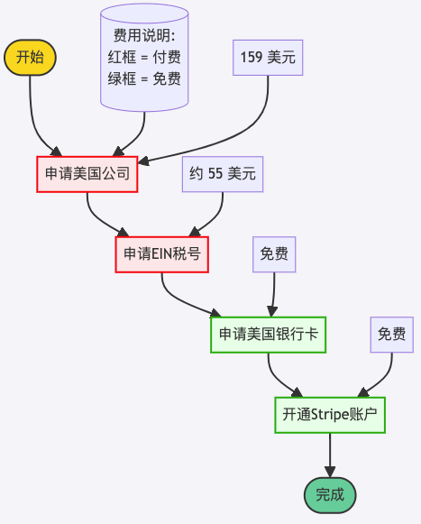

> 注意：
> - 「实益所有权信息报告」我注册的时候，只要 9 美元，现在涨价了，需要 25 美元。
> - 公司备案费用也涨价了，原来是 100 美元，现在需要 104 美元。
> - 所以上面的图片中，159 美元 -> 179 美元。
> - 大家需要注册的话，还是尽早行动起来吧。

### 花费时间
这是我第一次走完全流程，花费时间比较长，从 6 月 2 日申请注册公司开始，到 7 月 22 日激活 Stripe，一共花费了 51 天！这期间走了不少弯路（尝试了两次水星银行），遇到不少坑（比如 IRS 把公司法人名字写错了），主要时间都是等待上。

我这种情况比较特殊，大家应该不用这么多时间，下面是正常流程大概花费的时间，仅作参考。

| 流程 | 所需时间（工作日） |
|:-----------------|:----------------:|
| 公司注册 | 3 天 |
| 申请 EIN | 10 天 |
| 开通美国商业银行卡 | 5～7 天 |
| 激活 Stripe | 0 天 |

**注意：** 以上所列天数均为工作日，不包括周末和法定假日。

## 3. 注册海外公司
在这篇文章中，给大家介绍怎么注册一个海外公司，我注册的是美国的公司，所以这里就以美国公司为例了。

### （1）注册地址
👉 [wyomingagents](https://www.wyomingagents.com/)
（再推荐一个国内的海外公司注册平台，大家有兴趣可以了解一下 [IngStart](https://www.ingstart.com?s=QL)）

wyomingagents 是一家提供美国怀俄明州公司注册和管理服务的代理机构，怀俄明州的税收很低，适合小团队或者个人注册公司，成本低。

### （2）注册流程
- 选择「Form a Company」（成立公司）
>  - 这里显示注册公司只需要 $150，下面有一个「实益所有权信息报告」选项需要加上，届时再做说明。
>  - 不用先注册登录这个网站，在后续的流程中，会让你注册网站的。

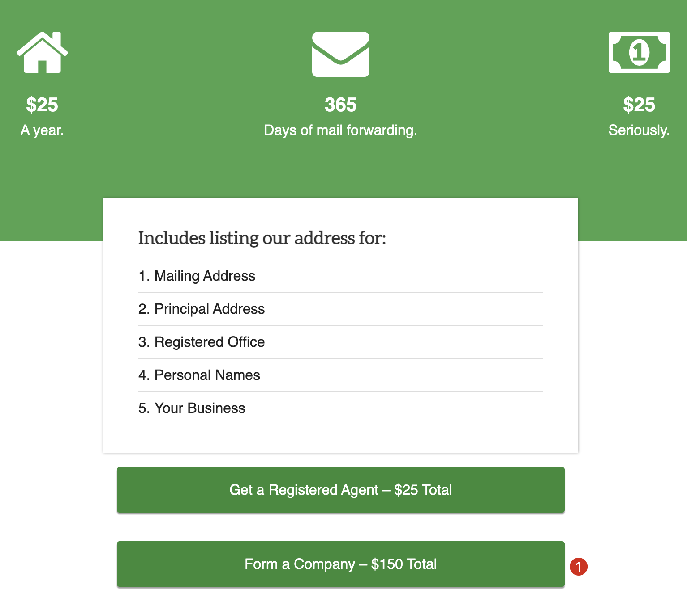

- 填写信息
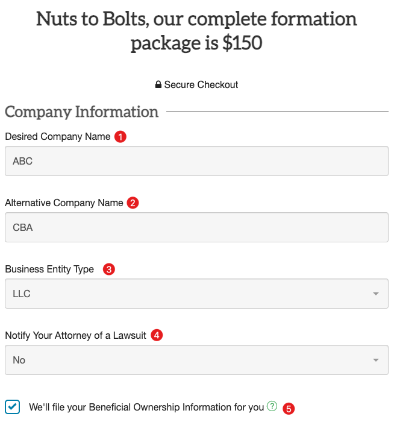

① **Desired Company Name (期望的公司名称)**：填写你的公司名称（英语公司名称）

② **Alternative Company Name (备用公司名称)**：填写你的公司备用名称，这是为了防止上面的公司名称不可用的情况下，可以选择这个备用公司名称来注册。

③ **Business Entity Type (企业实体类型)**：我们是个人公司，所以选择 LLC（单一成员有限责任公司）就可以了。

④ **Notify Your Attorney of a Lawsuit (通知您的律师有关诉讼)**：选择 NO，因为我们没有律师。

⑤ **"We'll file your Beneficial Ownership Information for you"
(我们将为您提交实益所有权信息)**：强烈建议这里直接勾选上，「实益所有权信息报告」是美国联邦法案要求大多数新成立和现有的美国公司向美国财政部的金融犯罪执法网络（FinCEN）报告其实益所有人的信息。另外，提供实益所有权信息可以增加公司的透明度，许多银行在为公司开设账户时会要求实益所有权信息。提前准备这些信息可以使开设银行账户的过程更加顺利。如果这里忘记勾选了，后面公司注册成功之后，可以再申请，或者找第三方渠道申请，这样太麻烦，不如这里直接勾选上。

---
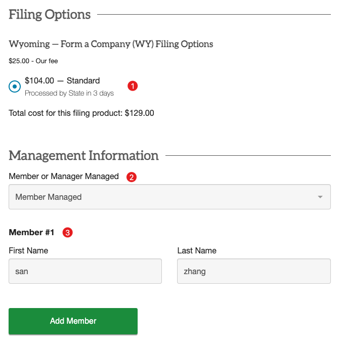

① **费用选项**：LLC 的公司就这一个选项，默认即可。涨价了，100 美元 -> 104 美元。

② **Member or Manager Managed (成员或管理者管理)**：默认即可。

③ **Member #1 (成员 #1)**：我们是一人公司，公司成员自然只有我们自己，填写自己的名字即可，拼音，比如张三，那么，First Name 是 san，Last Name 是 zhang。

④ 如果有合伙人，点击「Add Member」添加即可。

---
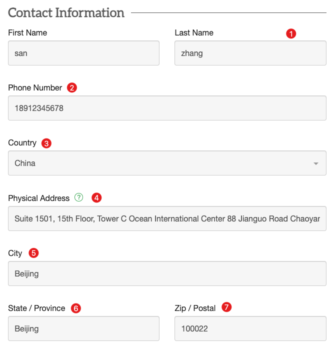

① **First Name、Last Name（姓名）**：跟上面一样，填写自己的姓名拼音。

② **Phone Number（电话号码）**：填写自己的真实手机号码。

③ **Country（国家）**：China（国籍是哪个国家就选择这个国家）。

④ **Physical Address（物理地址）**：填写真实地址，这一步很重要，一定要填写自己的真实地址，我填写的是住址，租的房子。建议把中文地址写一遍（平时收快递的地址），然后用 AI 翻译成英语表达的方式即可。

⑤ **City（城市）**：填写自己长期居住的城市，用拼音。

⑥ **State / Province（州/省）**：同理，填写自己长期居住的省或者市，用拼音。

⑦ **Zip / Postal（邮编）**：同理，填写自己长期居住地的邮政编码。

---
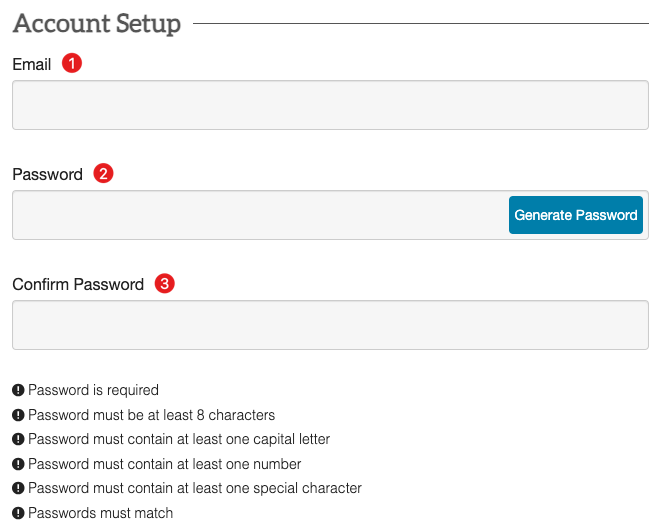

① **Email（电子邮件）**：这个步骤是注册 wyomingagents 网站的。填写自己最常用的邮箱即可。

② **Password（密码）**：密码，一定要按照要求填写密码，密码要求比较复杂，自己保存好，别忘了，公司相关的文档都会保存在这个网站，方便随时查看。
- 密码必须至少8个字符
- 密码必须包含至少一个大写字母
- 密码必须包含至少一个数字
- 密码必须包含至少一个特殊字符

③ **Confirm Password（确认密码）**：确认密码，要求两次输入密码必须一致。

---
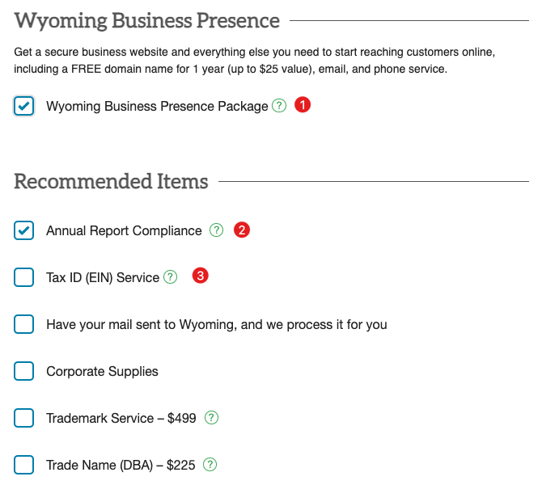

① **Wyoming Business Presence Package（怀俄明州商业启动套餐）**：这个套餐包含：
- 1 年免费域名（价值最高 25 美元）：后面会让你提供一个公司域名，然后会自动使用 WordPress 搭建一个很简单的公司官网，几乎没法用，需要自己去后台修改。
- 电子邮件和电话服务：会提供一个免费试用的美国怀俄明州的电话号码，有 APP，可以接收短信（亲测有效，但是电报的验证码收不到，问了官方，他们说应该是可以的，但我没收到，可能是网络或者其他原因，不纠结了），网络电话好像不太好用，几乎也用不着。

② **Annual Report Compliance（年度报告合规）**：默认选上，免费的，这是一项法律要求，每个公司都必须在其成立周年日提交。不遵守可能导致公司被州政府解散，后果很严重。

③ **Tax ID (EIN) Service（税务ID（EIN）服务）**：EIN 非常重要！后续申请美国银行卡，激活 Stripe 都用得着。但是这里我就不够选了，太贵了，美国国籍只需要 75 美元，但是非美国籍需要 250 美元，差别太大，太贵了，可以自己去美国国税局官网或者第三方找人申请，后面《2、申请 EIN 税号》文章中会详细说明如何操作和避坑。

④ 其他的，比如 Corporate Supplies（公司用品）、Trademark Service – $499（商标服务 – 499美元）、Trade Name (DBA) – $225（商业名称（DBA）– 225美元）等，一般都不需要，就不用勾选了。

---
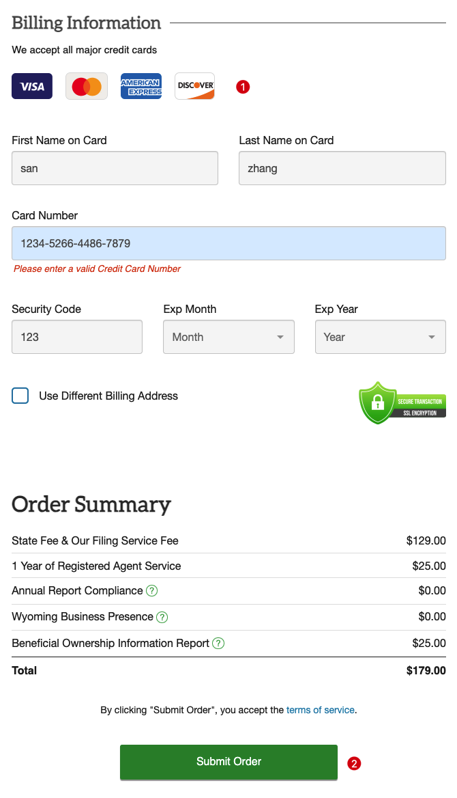

① 填写支付信息，确认账单，用国内的 Visa 信用卡就行，我用的是招行的 Visa 信用卡。

② 确认无误之后，点击提交订单，收到扣款短信（今年 6 月是 159 美元，现在涨价了），说明注册公司的订单成功了，接下来只需要等待就行，一般情况 3 天左右就能注册下来了，还是很快的。

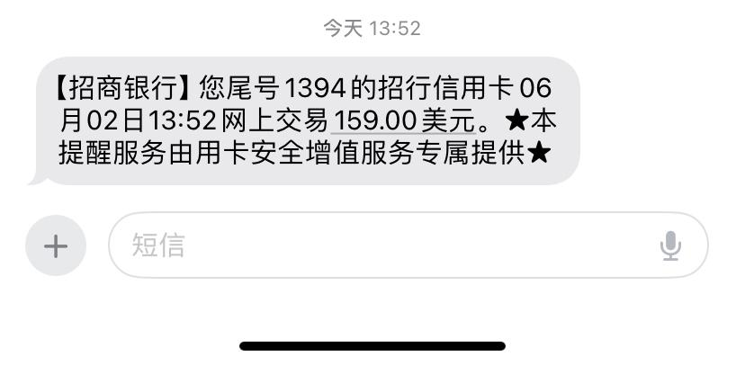

### （3）确认注册信息
完成以上注册公司订单之后，信息填写部分就完成了，接下来，登录网站，确认订单上填写的公司信息，过程就比较简单了，我就把当时的截图贴一下吧。

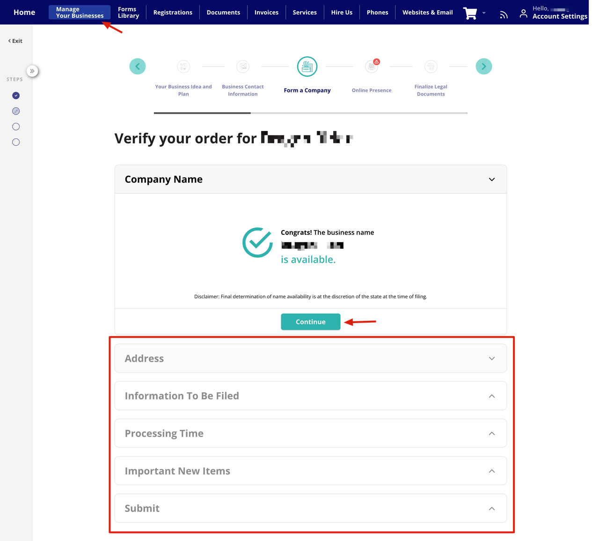

- 红色框里的内容都是需要确认的。
- 接下来，点击「Continue」，验证各种信息。

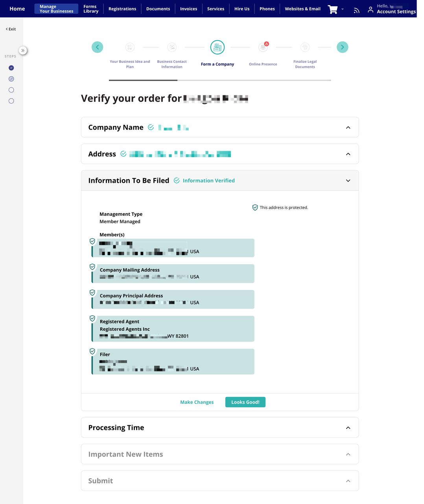

- 信息确认完之后，会给一个公司在美国的代理地址，这个地址就是公司注册地址，很多地方都用得到，记下来。

至此，怀俄明州美国公司的注册申请就算完成了，静静等待就行，过几天来官网看一下，公司注册成功之后，可以在网站上看到公司相关的文档：Operating Agreement（运营协议，重要文件）、Initial Resolution（初始决议）、Formation Document（成立文件）

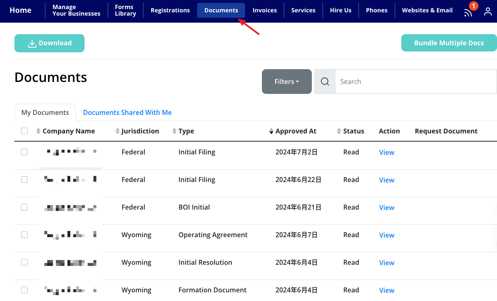

### （4）其他
- 上面注册过程中，套餐里包含网站，手机号，商业电子邮件等信息，大家可以登录网站后台查看。
- 公司网站是 WordPress 部署和发布的，后台有给账号和密码，自己登录 WP 修改官网，第一年是免费的，后面需要付费，可以在后台取消续费。
- 公司邮箱账号也是一样，可以登录邮箱后台，收发邮件。
- 美国手机号，下载他们的 APP，登录即可收发短信。
- 商业电子邮件、SSL、电话和网站在免费试用期结束后，每月每项收费 9 美元。域名将在 1 年免费试用期后，根据域名的市场价格每年收费 25 美元。续订服务和注册代理服务将按年收费。

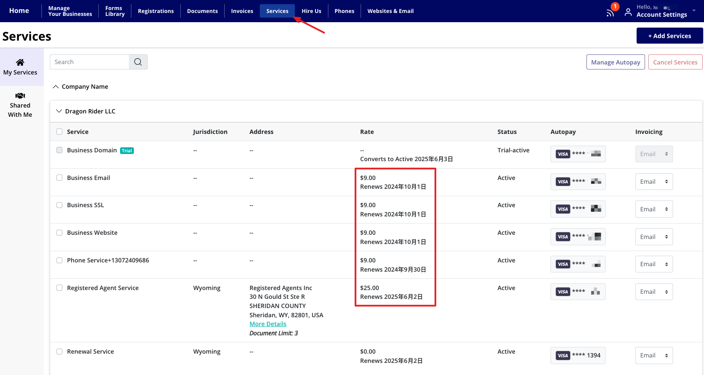

## 4. 说在最后
以上就是注册美国公司的基本操作流程了，还是挺简单的，如果大家有需要，我建议尽早注册，避免再次涨价，一人公司，能省一点是一点。

需要注意的是，如果需要开通空中云汇的支付，那么请一定要**去注册英国公司**，我也是后来才知道的，美国公司申请不下来，除非你有美国身份。但是能够开通美国银行卡，有了银行卡就可以接收 Stripe 的支付了。

在申请银行卡之前，需要先申请公司的 EIN，请前往 [2、申请EIN](./2、申请EIN.md)

# 推荐一个国内的海外公司注册平台
-  网址：[IngStart](https://www.ingstart.com?s=QL)

我最近了解到 IngStart 这个平台，感觉挺有意思的。它主要是帮人在美国、香港、英国和新加坡这些地方注册公司，还提供一些合规和税务方面的服务。

用起来好像挺方便的，你可以在网上注册账号，然后就能在线完成整个注册流程。他们还会帮你搞定代理地址和股东信息之类的事情。

我觉得它的好处就是把所有事情都集中在一起了，管理起来也比较简单。而且它有中文服务，对咱们来说挺友好的，价格也很有竞争力，重点是： **一条龙服务，省事！**

如果你对这个感兴趣的话，可以去他们网站上问问客服，应该能了解更多详细信息。总的来说，感觉是个还不错的选择，特别是对那些想在海外开公司但又不想太麻烦的人来说。