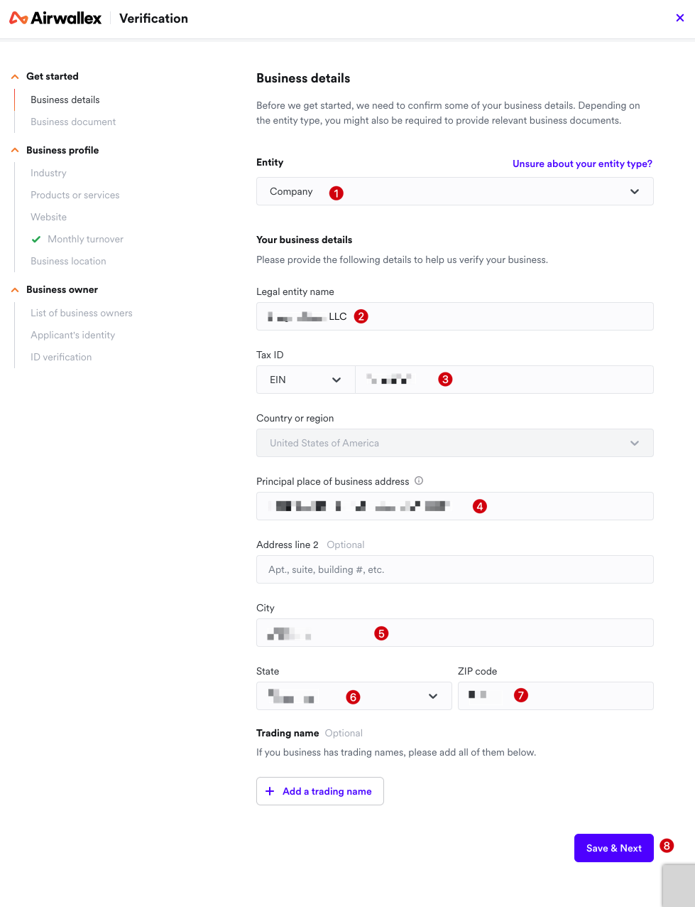
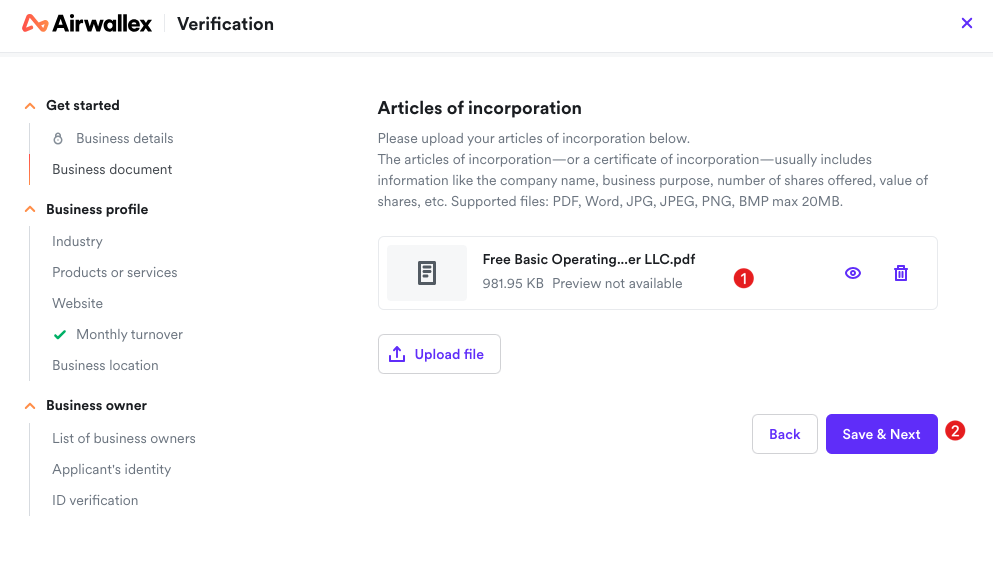
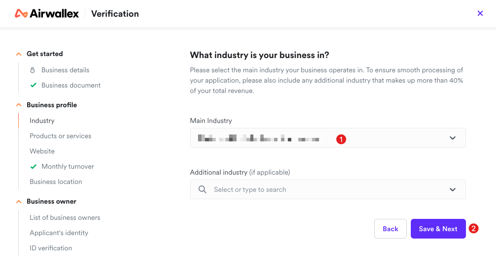
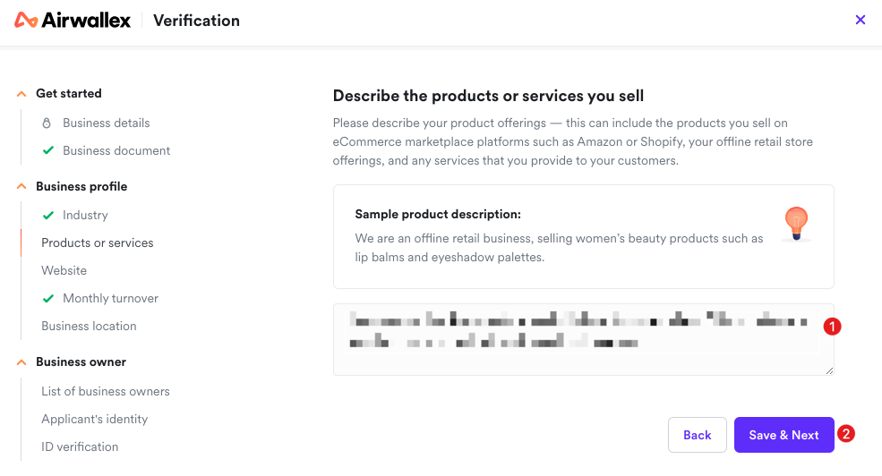
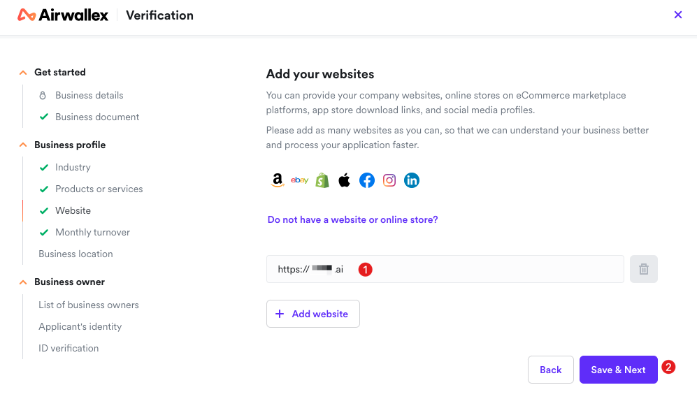
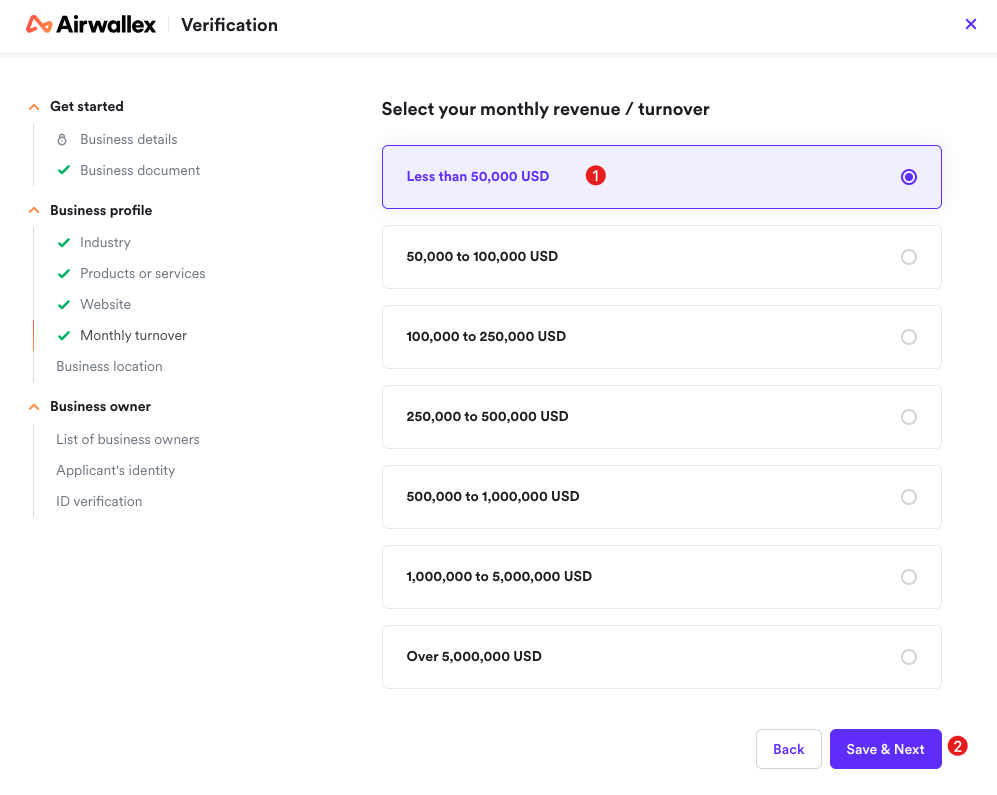
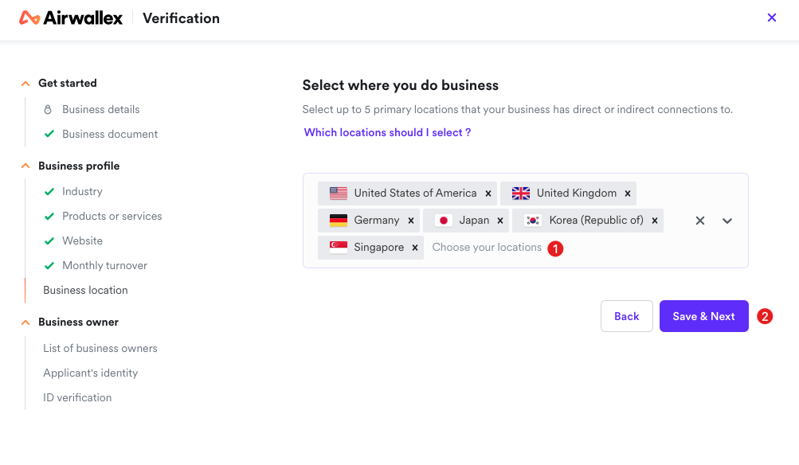
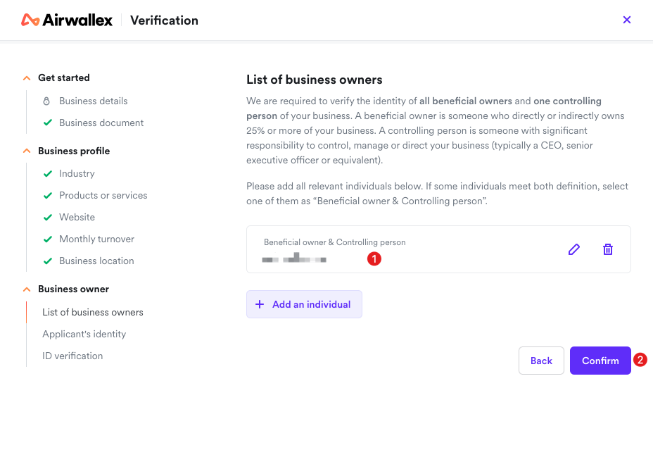
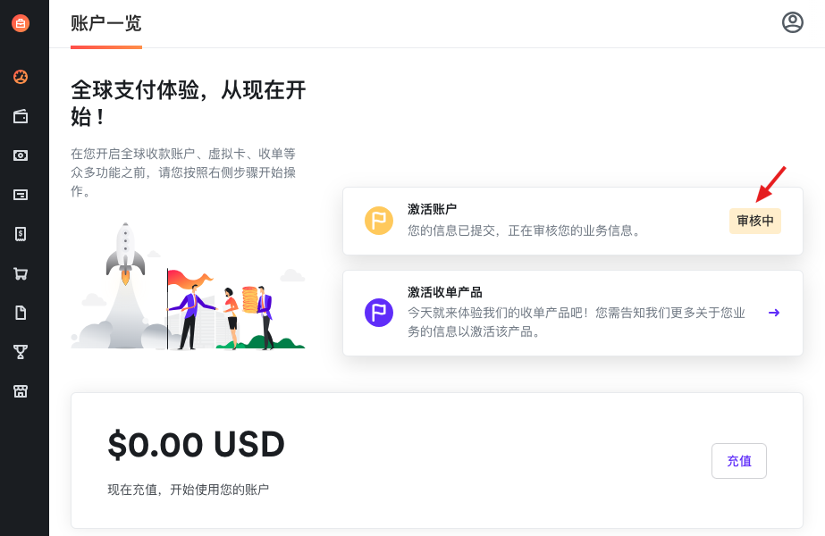
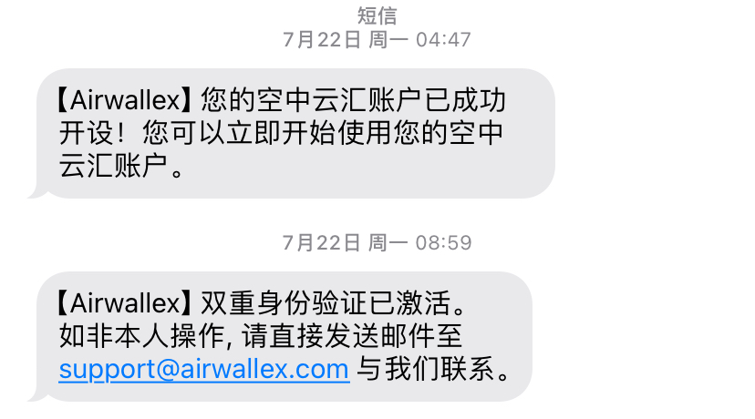

# 申请美国银行卡

## 1. 为什么要申请美国商业银行卡？
- 激活 Stripe 要求是商业银行卡，不建议使用个人银行卡。
- 分离个人和商业财务，可以规避一些税收等问题。
- 还有其他好处，请自行 Google。

## 2. 选择开通银行卡的机构
对于出海同学来说，可能听到最多的是“水星银行”了，“水星银行”其实不是银行，是一家靠谱的金融机构，水星的卡特别适合小团队和个人公司，便捷且费用低。

但是现在水星银行对国内的用户好像越来越严格了，我申请了两次，都没有通过，邮件询问官方，也没有给出具体原因，资料都是按照要求提交的。

后来，我放弃了申请水星银行。了解到“空中云汇”也可以开通美国商业银行卡，于是就去申请了。

## 3. 开通“空中云汇”的美国商业银行卡
> 请注意，如果需要开通“空中云汇”的支付功能的话，请一定要申请英国或香港公司，或者申请之前跟官方人员沟通一下。

### （1）地址
👉 [Airwallex 空中云汇](https://www.airwallex.com/cn/signup)

### （2）开通流程

① 注册公司所属国家：美国

② 和 ③ 公司的法人姓名，也就是你自己的名字，这里填写中文姓名即可。

④ 手机号：填写自己正在使用的手机号即可。

⑤ 密码：登录“空中云汇”的密码，牢牢记住。

⑥ 企业邮箱：我填写的是注册公司的时候申请的邮箱。

---

选择开通“空中云汇”的用途，一般情况下，选择「收单、接收转账、多币种换汇」这 3 个就够了。

---

① **验证邮箱**：比较简单，点击进去，然后去验证就行了。

② **激活账户**：这一步有一些繁琐，一共分为 10 个小模块，需要填写的信息比较多，下面来一一介绍。

---

① **Entity（实体类型）**：选择「Company」。

② **Legal entity name（法定实体名称）**：公司的名称，比如：ABC LLC。

③ **EIN（雇主识别号）**：这里就是 [申请 EIN](./2、申请EIN.md) 中申请的税号了。

④ **Principal place of business address（主要营业地址）**：填写当前自己常住的有效地址，跟申请注册公司一样就行。

⑤、⑥、⑦ 很简单，填写地址对应的城市，省/市和对应的邮政编码即可。

---

① 这一步就是需要上传 [海外公司注册](./1、海外公司注册.md) 里的公司注册文件，下载下来，上传即可。

---

① 选择你的公司主要经营的行业，根据自己主营的行业来选择就行。

---

① 这里填写你的公司产品或服务描述，按照实际情况填写就行，按照例子的写法，简单清晰明了即可。

---

① 填写你的网站地址，注意是已上线的网站，可以是自己公司官网，网站不要过于简陋，像个正常的网站，最好是跟自己前面填写的业务相关。也可以是电子商务平台上的在线商店、应用商店下载链接和社交媒体资料。可以添加多个网站，毕竟是人工审核，资料越详细越真实，就越容易通过。

---

① 选择你的公司产品或者服务的月收入或者营业额，如果还没有收入，选择第一个最少的那个就行了。

---

① 选择你的业务开展的地区，最多选择 5 个地区，如果是面向全球的业务，选择几个主要国家即可。

---

① 填写你的公司实际控制人，一人公司就填写自己的名字，如果还有合伙人，继续添加即可。

---

> 这里填写的是申请人的信息。作为申请人，我们还需要完成在线实时身份确认步骤。点击 “Submit” 后，系统会引导我们上传身份证复印件，并通过简单的视频互动来验证我们的身份。

①～⑤ 填写自己的姓名。，职位，出生日期和国籍等信息，不再赘述。

⑥～⑨ 填写政府身份证件：“空中云汇”目前只接受中国公民的中国身份证。如果不是中国公民，需要提供中国境外发行的身份证件。我们直接提选择个人身份证即可，这里选择，等到在线实时身份确认的时候，会让你拍照的。

⑩～⑭ 填写我们当前常住的地址信息，这里可以直接填写中文地址。

⑮ 点击「Submit」提交之后，会跳转到在线身份验证部分，按照提示进行操作验证即可，比较简单。

---

上面的信息填写完成之后，我们就可以看到“激活账户”变成「审核中」状态了。

## 3. 说在最后
再啰嗦一下，如果需要“空中云汇”的支付功能，那么请注册英国或香港公司，美国公司几乎行不通（除非你有美国籍），这是我跟官方沟通过的结果。

不过，我们一般也不用“空中云汇”的支付功能，能开通美国银行来收款就可以了，支付功能我们直接激活 Stripe 就行。

申请填完“空中云汇”流程之后，我们接下来等待就行，一般 3～5 个工作日，“空中云汇”的工作人员会打电话给你，就是确认一些信息，以及说明美国公司要想开通“空中云汇”的全部功能，需要哪些条件和资料。

我们当时没有沟通清楚，我以为美国公司不能开通“空中云汇”了，正准备去找其他替代方案了呢，结果过了几天之后，收到短信，账号开通成功了。

然后，我们登录“空中云汇”网站，去后台开通选择和开通美国商业银行卡就可以了。

至此，我们终于完成了美国商业银行卡的开通，接下来就是出海网站收款全流程的最后一步了，请前往 [4. 激活Stripe](./4、激活Stripe.md)