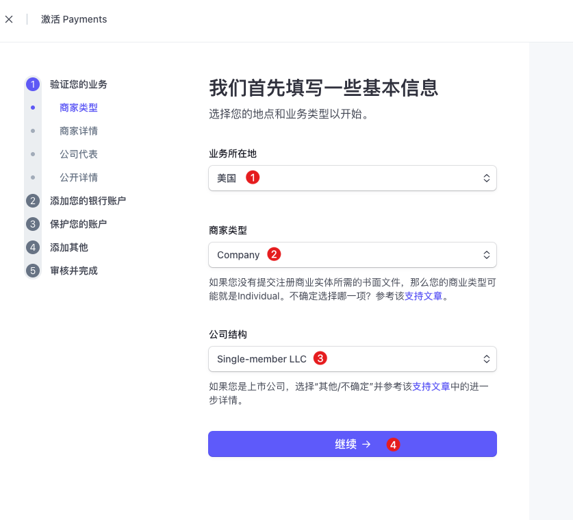
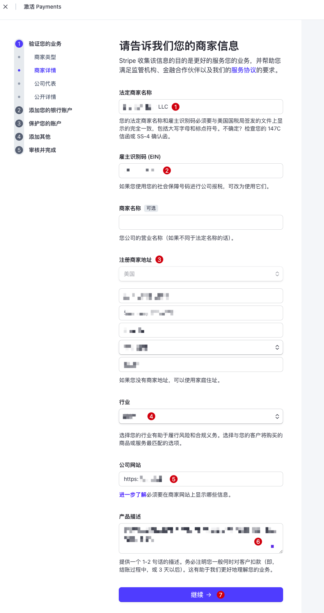
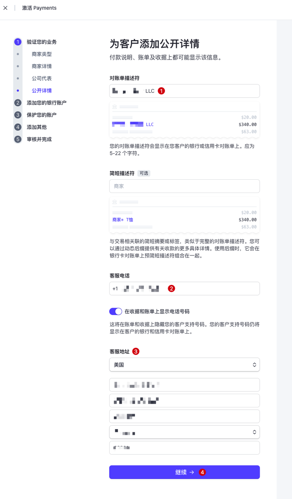
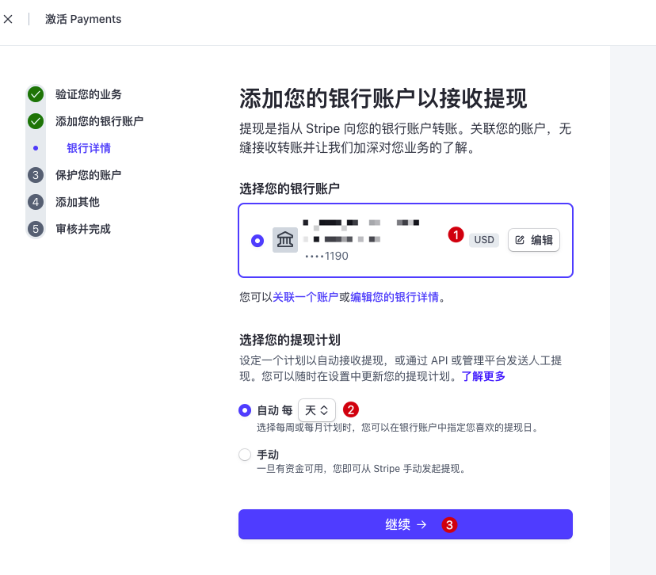
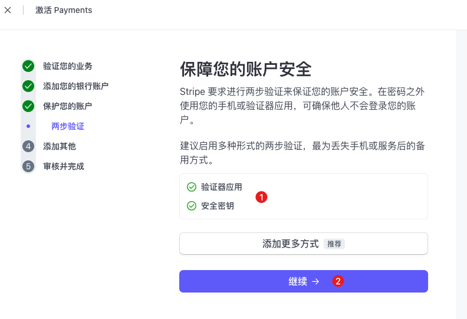
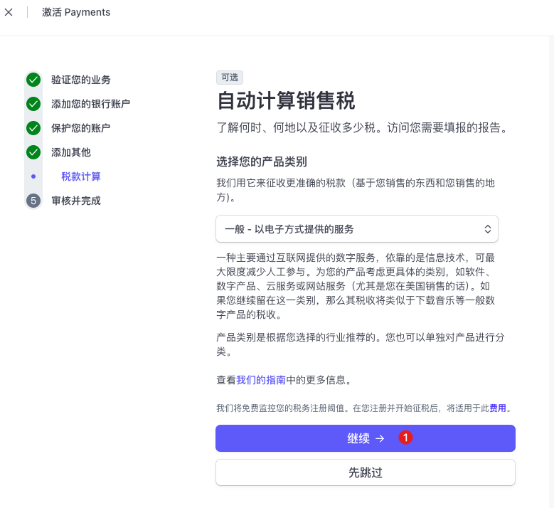
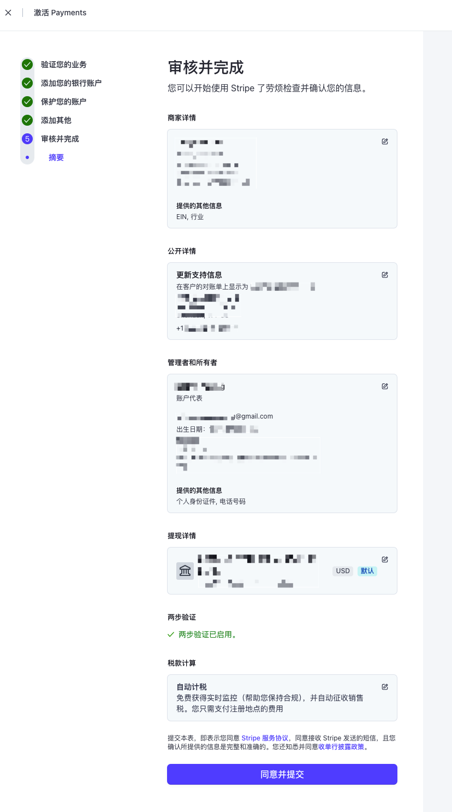
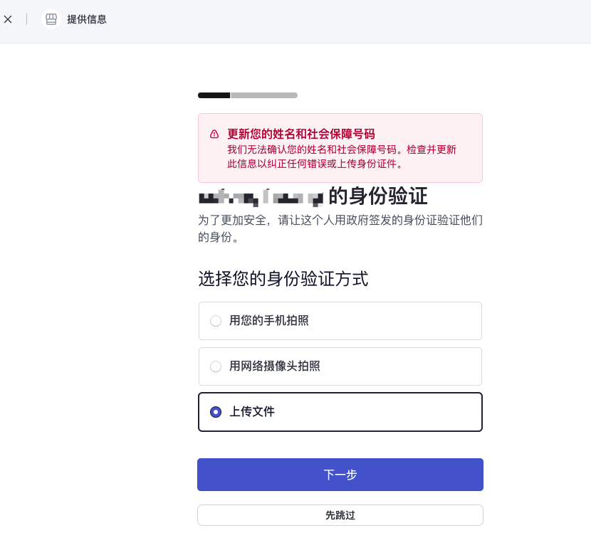
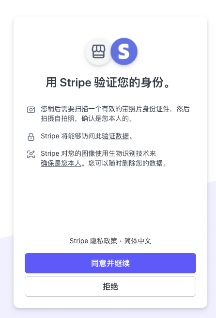
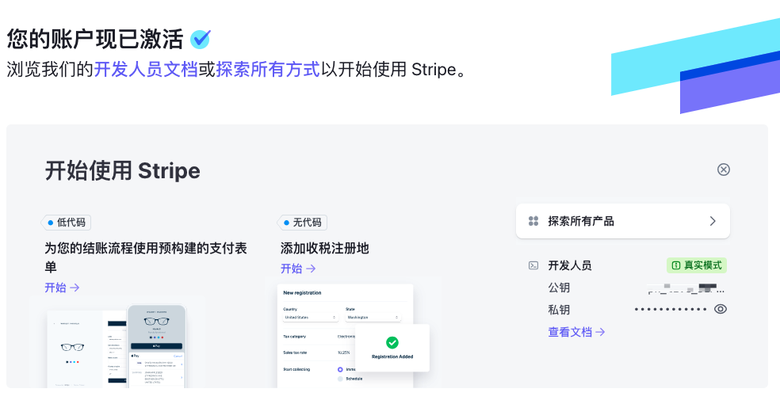

# 激活 Stripe

相信大家如果做出海网站，多少都听说过 Stripe 了吧，Stripe 安全可靠，容易上手，费用相对较低，客户支付体验好，可以说是出海网站支付首选了。

看到这的同学应该都已经准备好公司，EIN 和海外商业银行卡了吧，如果还没有准备好，请先看下下面的 3 篇文章参考一下吧。
[1、海外公司注册](./1、海外公司注册.md)
[2、申请EIN](./2、申请EIN.md)
[3、申请美国银行卡](./3、申请美国银行卡.md)

下面我们开始一步一步来激活 Stripe 吧。

## 1. 激活 Stripe

### （1）地址

👉 [Stripe 官网](https://stripe.com/)

### （2）激活 Stripe

① **业务所在地**：美国，选择自己注册公司真实所在国家。

② **商家类型**：选择 Company 即可。

③ **公司结构**：Single-member LLC，选择实际公司的类型。

---

① **法定商家名称**：填写自己注册的公司名称。

② **雇主识别码（EIN）**：填写公司的税号 EIN。

③ **商家注册地址**：这里填写注册海外公司时给的公司海外地址。

④ **行业**：选择公司实际的业务或服务所属的行业。

⑤ **公司网站**：这里可以填写申请公司时搭建的公司官网，但是太简单的话不行，可以是已上线的其他网站，我填写的是刚上线不久的 AI 图片网站：https://imgai.ai

⑥ **产品描述**：填写网站提供的功能，如实简洁描述即可。

---

① **法定名称**：这个步骤是来验证公司法人信息的。这里填写自己的姓名，中文就行。

② **邮件地址**：填写自己常用的邮箱即可，建议 Google 邮箱。

③ **出生日期**：填写自己的出生日期，和身份证上的保持一致即可。

④ **家庭住址**：填写自己当前常住地址即可。

⑤ **电话号码**：这里我填写的是注册公司时买的美国号码，如果没有，填写中国手机号应该也可以。

⑥ **个人身份证号码**：选择中国（CN），然后填写自己的身份证号码。

---

> 这部分是对客户提供的公司公开详情，这些信息可能会显示在付款说明、账单或者收据上。

① **对账单描述符**：直接填写公司名称就行。

② **客服电话**：我填写的是公司的电话，可以关闭在收据和账单上显示。

③ **客服地址**：我填写的是公司的美国注册地址。

---

① **选择您的银行账户**：这里直接填写 [3、申请美国银行卡](./3、申请美国银行卡.md) 申请开通的美国商业银行卡信息即可。

② **选择您的提现计划**：自定义选择提现计划，自动或手动都可以。

---

① 这一步是 Stripe 账号的两步验证，按照要求进行操作就行了，挺简单的。

---

① 选择税款计算方式，我选择的默认方式：一般 - 以电子方式提供的服务。你也可以看一下其他方式，哪种适合自己就选择哪种，不知道哪种合适，就选择默认的。

---

截止到这一步，信息填写部分基本就完成了，直接点击「同意并提交」，然后应该就会跳转到一个「补充身份验证资料」的页面，前面还记得填写过身份证号吗？这里就需要上传或者拍照上传身份证照片了。

---

这一步就是「补充身份资料验证」了，选择自己方便的方式上传身份资料就行，最好是提前准备好身份证的正反面照片，然后直接上传即可。

---

完成以上所有步骤之后，就会跳转到「激活成功」页面，这时候我们的 Stripe 激活就算是完成了！剩下的就是我们自己按照 Stripe 文档，把支付对接到我们的网站就可以啦！

## 2.  说在最后
好了，到这里，我们就走完了出海网站收款的全流程了，走之前感觉挺麻烦的，但自己必须要走，走的过程中，我遇到各种问题，各种意外情况，尝试摸索着，走完整个流程，前后花费了一个多月时间。

现在回过头来看，这些经历挺值得的，只有自己走过一遍，才知道是这么回事，下次再走，就简单了许多。

如果这些经历能够对你有所帮助，那我可就太开心啦！

最后的最后，祝大家也祝自己：出海之路，乘风破浪，一帆风顺，收获满满！