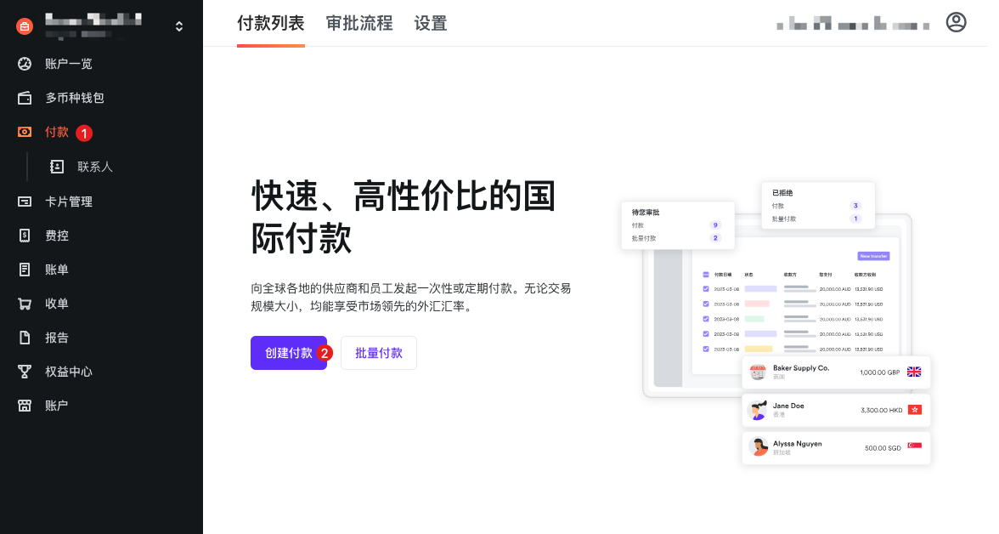
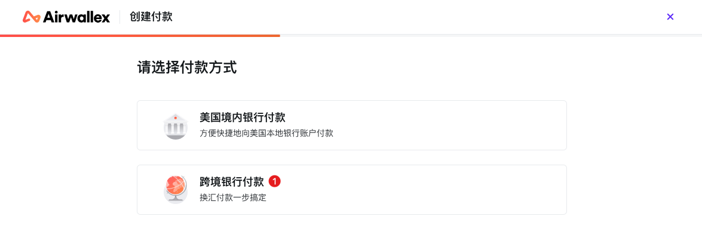
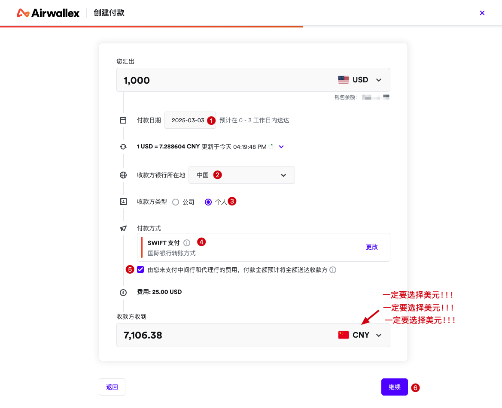
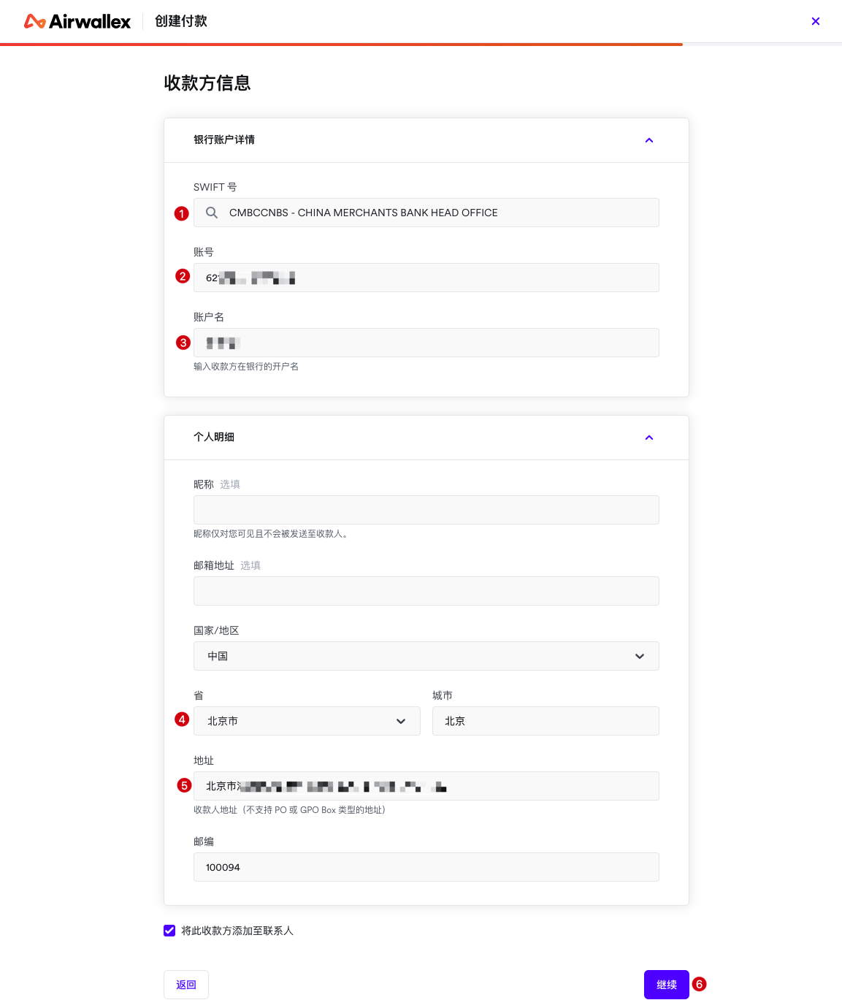
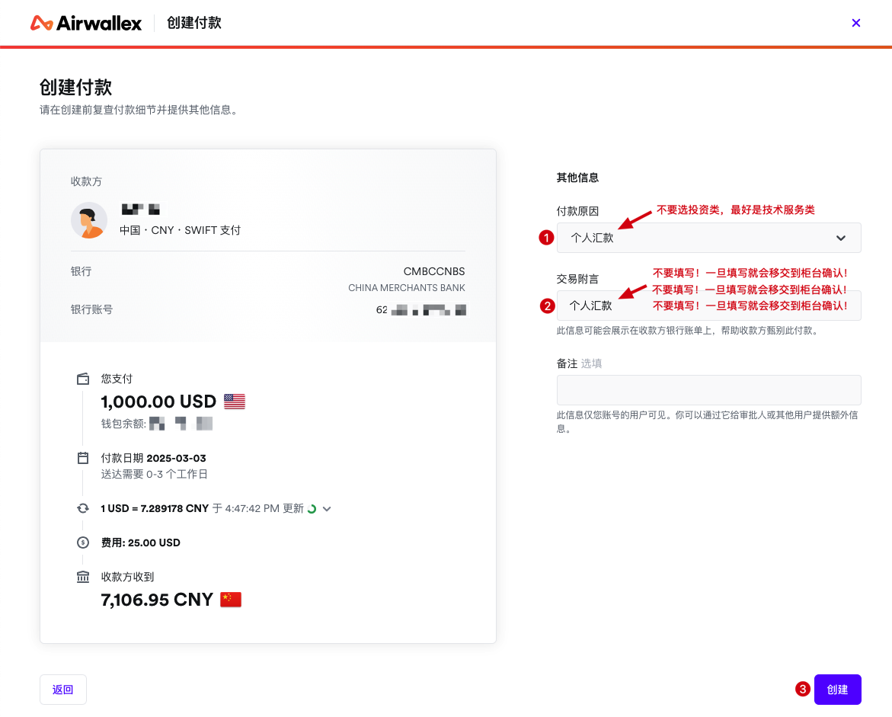
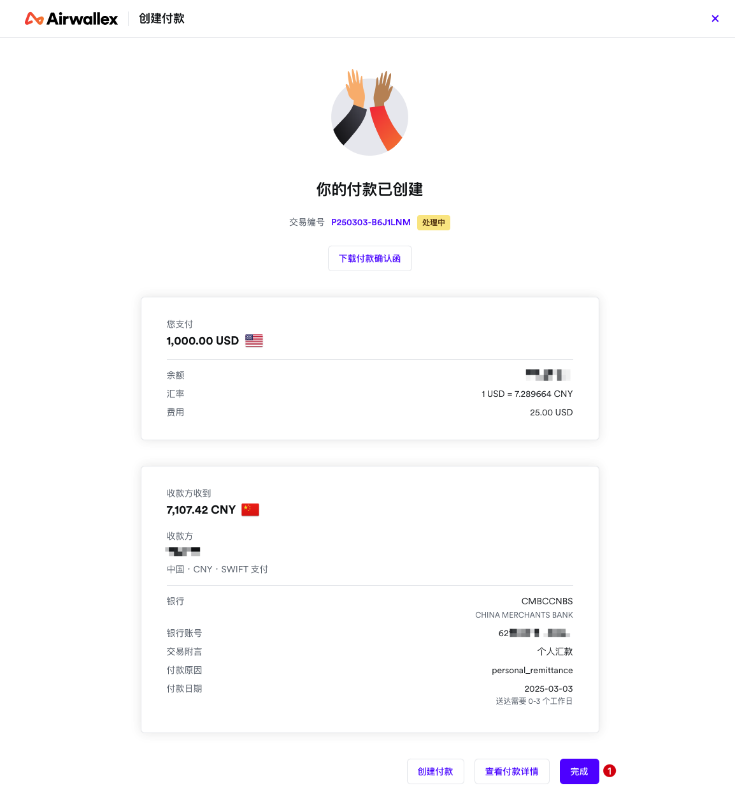
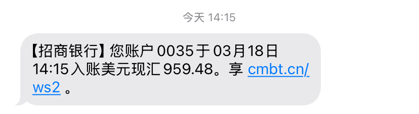

# 回款回国

大家好，距离上次更新有一段时间了，就在刚才，收到银行的短信，终于顺利回款到国内了。

下面我就把回款的详细流程分享给大家。在这过程中遇到了一些坑，希望可以帮大家避坑。

先说一下，下面的截图是我第一次申请回款的时候截的图，有几个坑已经在图里标出来了，大家可以看一下。

另外，我使用的是空中云汇平台，如果使用的是别的平台，也可以参考一下。

## 1. 创建付款

登录空中云会后台，点击 ① 付款 -> ② 创建付款

## 2. 选择付款方式

① 选择跨境银行付款

## 3. 填写回款信息

这一步很关键，一定要填写正确：
- 选择需要回款的金额

- ① 选择回款日期，试了两次，都是第二天就到了

- ② 收款银行所在地选「中国」

- ③ 收款类型：个人

- ④ 付款方式选择「SWIFT 支付」

- ⑤ 这个够不够选都行，可以理解为是「寄付」还是「到付」

- 空中云汇的手续费是 2.5%，不算高也不算低

- **特别注意**：`收款方收到的币种一定要选择 USD（美元）！这是我遇到的第一个坑，第一次回款，我选择的是 CNY（人民币），回款到招行了，招行打电话，要我提供证明，需要证明这个款项是正规渠道来的，比如合同等，说是每一分人民币都要明确具体来源，不然不能入账。`

- ⑥ 下一步

## 4. 收款方信息

这一步按要求填写即可：

- ① 选择对应收款银行的 SWIFT 号码，我是北京的招行卡，所以选的招行总行的代码，如果能找到自己开户行的代码就选开户行的，不然就选总行的

- ② 收款银行卡号，注意先确认一下自己的银行卡是不是双币的，招行在 App 里的「跨境金融」里

- ③ 账户名就是收款银行卡的开户名

- ④ ⑤ 填写自己所在地址，中文就行

- ⑥ 下一步

## 5. 付款原因

这一步是我遇到的第二个坑：

- ① 付款原因：尽量选择「技术服务类」，不要选一些稀奇古怪的，后来我问了招行的工作人员，「个人汇款」也比较模糊，不建议选，「技术服务类」比较清晰

- ② 交易附言：`一定不要填写!!!招行工作人员跟我说，在金额不大的情况下，如果有交易附言，这笔汇款也会经过柜台人工审核，会打电话，找你要证明，所以金额不大的时候（一万美金一下，好像是这么多），不要填写附言，这样一般情况下直接就直接入账了`

- ③ 完成付款

## 6. 完成付款

至此，整个付款流程就创建好了。

## 7. 事情记录

我本来 3 月 3 日就创建了付款，3 月 4 日银行打电话给我，我没收到，忘记回电话了，过了几天想起来了，打了回去，银行说我这是人民币，需要提供正常来源的证明材料才能入账，没办法只能选择退款，大概过了 3～4 天，退款成功，扣了手续费（不是招行扣的）。

又过了几天，昨天重新创建了付款，今天上午银行打电话过来确认，原来是因为填写了「交易附言」，这笔交易就会经过柜台人工确认。

这时候我人都麻了，心想又得退款了，不过好在金额比较小，招行的工作人员也比较友好，最后还是比较顺利的完成了入账。

所以，大家在回款回国的时候，一定要注意上面的两个坑：
- **到账币种选择美元（USD）**
- **交易附言不要填写，所有能不填写的都不填写**